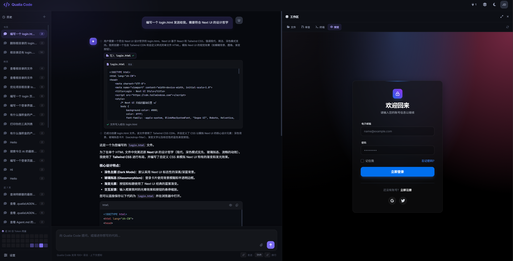
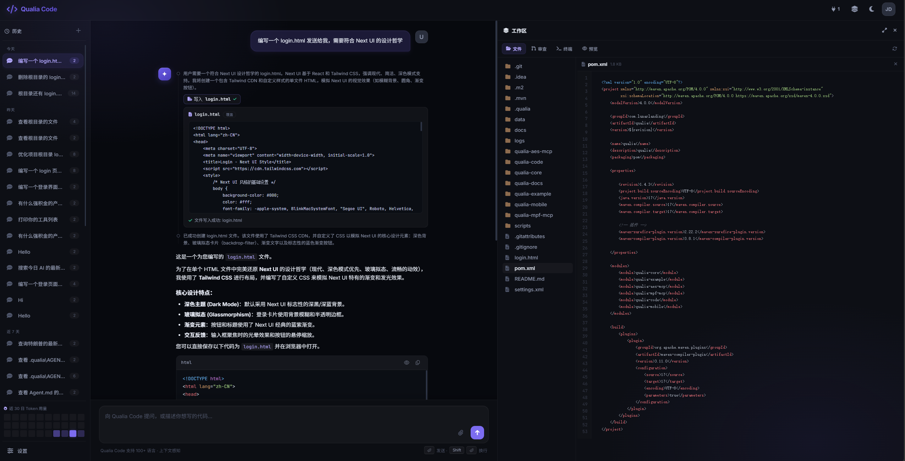
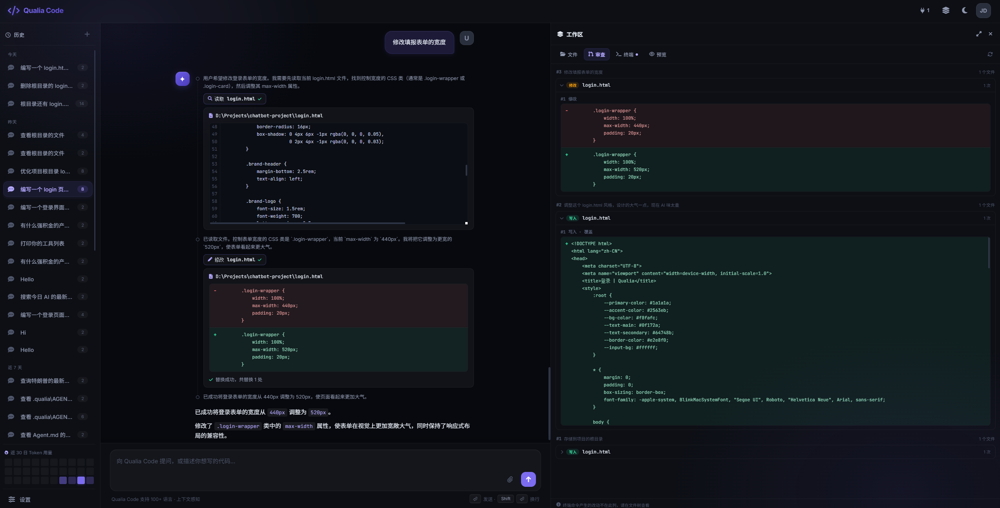
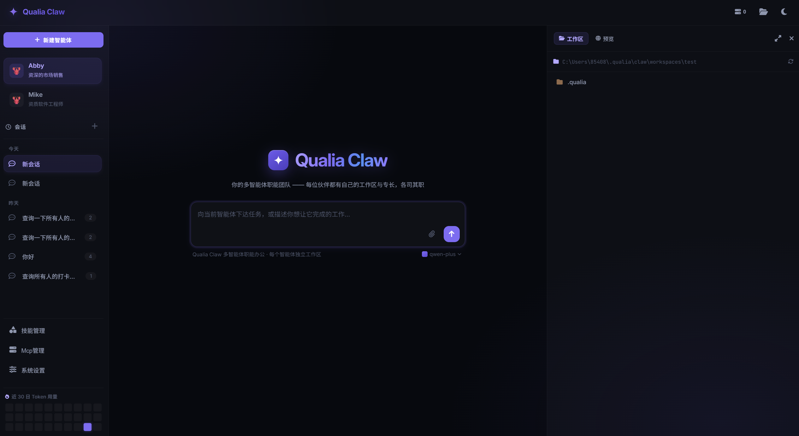
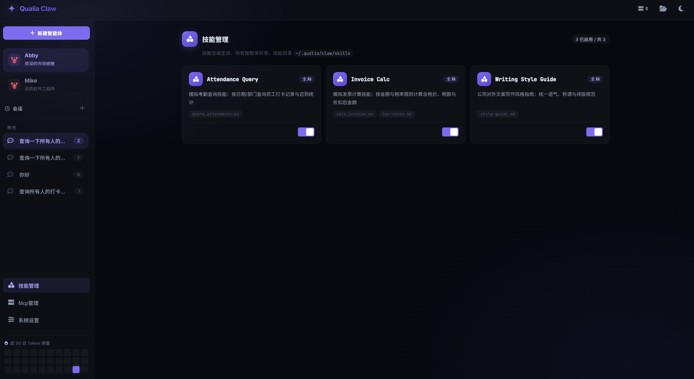
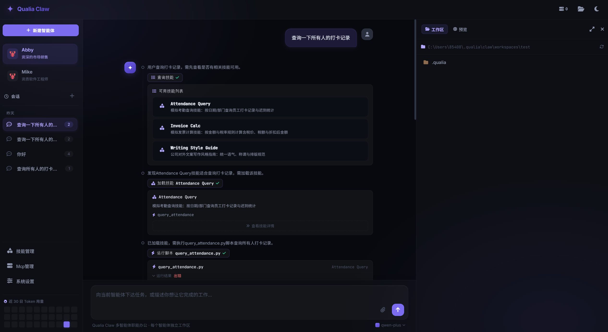

<div align="center">

# Qualia

**企业级 Java AI 智能体框架**

*基于 ReAct 模式，集成 MCP 工具链，快速构建 LLM 驱动的智能应用*

[](https://central.sonatype.com/artifact/cn.lunarlanding/qualia-core)
[](LICENSE)
[](https://adoptium.net/)
[](https://spring.io/projects/spring-boot)
[](https://maven.apache.org/)
[](https://modelcontextprotocol.io/)

[快速开始](#-快速开始) · [产品展示](#产品展示) · [发布](#-发布)

[English](README.md) | **简体中文** | [日本語](README.ja.md) | [한국어](README.ko.md)

</div>

---

## 概述

Qualia 是一个轻量级、模块化的 Java 框架，用于构建基于大语言模型的智能体应用。它提供完整的智能体开发框架，支持多模型接入、工具调用、知识库检索、技能扩展等能力，适用于构建企业级 AI 助手、智能客服、代码助手等场景。

基于 ReAct（Reasoning + Acting）推理模式，通过思考-行动-观察循环支持复杂任务分解；统一接口适配 DashScope、OpenAI、Claude 等主流 LLM；采用注解驱动 + MCP 协议集成的工具系统，轻松扩展工具能力；基于 JSON/MySQL 的会话记忆管理，支持滑动窗口和摘要压缩; 以及可复用的提示词模板与脚本执行的技能系统，支持渐进式加载。

## 项目

```
qualia/
├── qualia-core/          # 核心模块
├── qualia-code/          # Code 模块 (包括 web 服务)
├── qualia-code-desktop/  # Code 桌面应用
├── qualia-claw/          # Claw 模块 (包括 web 服务)
├── qualia-claw-desktop/  # Claw 桌面应用
└── qualia-docs/          # 项目文档
```

**Qualia-core** 框架核心模块，提供智能体核心架构（ReActAgent、HarnessAgent）、模型协议抽象层（ChatModel、EmbeddingModel、RerankModel）、工具系统和 MCP 集成、会话记忆管理、RAG 检索管道以及技能系统。

**Qualia-code** AI 编码助手产品，基于 Qualia 框架构建，提供完整的 Web IDE 体验，支持多会话管理与工作区切换、代码生成与分析、文件读写与搜索、终端命令执行、工具调用可视化展示、MCP 服务器管理、多模型配置与动态切换，以及流式响应和实时交互，支持桌面应用和 Web 两种部署模式。

**Qualia-code-desktop** 桌面应用模块，基于 SWT 构建，内嵌浏览器加载 Web IDE 界面，提供原生桌面应用体验，支持窗口状态持久化（尺寸、位置、最大化状态）、系统标题栏主题联动（深色/浅色自动适配）以及跨平台支持（Windows/macOS）。

**Qualia-claw** 多智能体协作产品，基于 Qualia 框架构建，每个智能体拥有独立工位（系统托管工作区 + 独立会话记忆），支持职能角色设定、多智能体并行对话、全局技能与 MCP 服务器按智能体白名单引用、工作区文件浏览与预览、会话 token 用量统计，配置统一收敛在用户目录按产品隔离存储，同样支持桌面应用和 Web 两种部署模式。

**Qualia-claw-desktop** Claw 桌面应用模块，与 Qualia-code-desktop 同构（SWT + 系统 WebView），锁文件、窗口状态、崩溃日志按产品目录隔离，可与 Qualia Code 桌面版同时运行。

## 🚀 快速开始

### 安装

qualia-core 已发布到 Maven Central，在项目 `pom.xml` 中添加依赖即可：

```xml
<dependency>
    <groupId>cn.lunarlanding</groupId>
    <artifactId>qualia-core</artifactId>
    <version>${latest}</version>
</dependency>
```

### 5 分钟上手

```java
// 1. 初始化模型和记忆
ChatModel model = new DashscopeChatModel("your-api-key", "qwen-turbo");
Memory memory = new InMemoryMemory();

// 2. 创建智能体并注册工具
ReActAgent agent = new ReActAgent(model, memory);
agent.setSystemPrompt("你是一个专业的智能助手。");

// 注册工具（注解驱动）
agent.registerToolsFrom(new MyTools());

// 3. 执行对话
AgentResponse response = agent.call("session-1", "帮我搜索AI最新进展");
System.out.println(response.getAnswer());

// 4. 流式调用
Flux<AgentResponse> stream = agent.callStream("session-1", "解释量子计算");
stream.subscribe(step -> System.out.println(step.getAnswer()));

// 工具类定义
public class MyTools {
    @AsFunctionTool(name = "search", description = "搜索互联网信息")
    public String search(@Param("query") String query) {
        // 搜索逻辑
        return "搜索结果";
    }
}
```

### 产品展示

**Qualia Code** 是基于 Qualia Core 框架构建的 AI 编码助手产品，提供完整的 Web IDE 体验。支持多会话管理与工作区切换、代码生成与分析、文件读写与搜索、终端命令执行，工具调用过程可视化展示。同时提供 MCP 服务器管理、多模型配置与动态切换、全局与工作区级技能扩展，支持桌面应用和 Web 两种部署模式。







**Qualia Claw** 是基于 Qualia Core 框架构建的多智能体协作产品，每个智能体拥有独立工位（系统托管工作区 + 独立会话记忆），支持职能角色设定与多智能体并行对话。全局技能与 MCP 服务器按智能体白名单引用，内置工作区文件浏览与预览、会话 token 用量统计。配置统一收敛在用户目录按产品隔离存储，同样支持桌面应用和 Web 两种部署模式。







## 📦 发布

### Maven Central

qualia-core 已发布到 Maven Central。

```bash
# 发布 qualia-core 到 Maven Central
mvn clean deploy -pl qualia-core -am -DskipTests
```

### 构建桌面应用

```powershell
# 构建可执行 jar
mvn -pl qualia-code-desktop -am clean package -DskipTests
mvn -pl qualia-claw-desktop -am clean package -DskipTests

# 打包成 Windows 应用（免安装）
.\qualia-code-desktop\packaging\package-win.ps1
.\qualia-claw-desktop\packaging\package-win.ps1
```

产物：`qualia-code-desktop\target\dist\<version>\Qualia Code\Qualia Code.exe` 与 `qualia-claw-desktop\target\dist\<version>\Qualia Claw\Qualia Claw.exe`

## 📄 许可证

本项目采用 [Apache License 2.0](LICENSE) 许可证。
