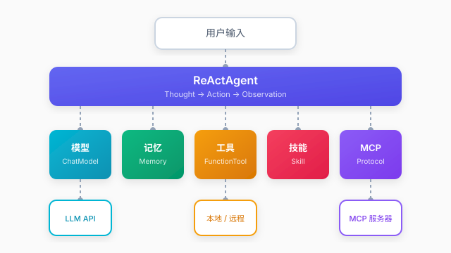

# 快速入门

## 概述

Qualia 是一个轻量级 Java 智能体框架，基于 ReAct（Reasoning + Acting）模式实现多步骤推理。框架提供 Agent、Model、Tool、Memory、MCP 五大核心能力，帮助开发者快速构建智能体应用。

### 整体架构



## 环境要求

- JDK 17+
- Maven 3.6+

## 添加依赖

```xml
<dependency>
    <groupId>cn.lunarlanding</groupId>
    <artifactId>qualia-core</artifactId>
    <version>${latest}</version>
</dependency>
```

## 5 分钟上手

### 1. 创建智能体

```java
// 初始化模型
ChatModel model = new DashscopeChatModel("your-api-key", "qwen-turbo");

// 创建记忆（基于 SQLite）
Memory memory = new SessionMemory(dataSource);

// 创建智能体
ReActAgent agent = new ReActAgent(model, memory);
agent.setSystemPrompt("你是一个专业的智能助手。");
```

### 2. 注册工具

```java
// 创建搜索工具
Tool searchTool = FunctionTool.builder()
    .name("search")
    .description("搜索互联网信息")
    .parameter("query", String.class, "搜索关键词", true)
    .execute(args -> searchWeb(args.get("query").toString()))
    .build();

// 注册到智能体
agent.addTool(searchTool);
```

### 3. 执行对话

```java
// 同步调用
AgentResponse response = agent.call("session-1", "帮我搜索AI最新进展");
System.out.println(response.getAnswer());

// 流式调用
Flux<AgentResponse> stream = agent.callStream("session-1", "解释量子计算");
stream.subscribe(step -> System.out.println(step.getAnswer()));
```

## 核心组件

| 组件 | 说明 | 文档 |
|------|------|------|
| **Agent** | ReAct 智能体，支持多步骤推理 | [智能代理](/docs/react-agent) |
| **Model** | 多模型适配，支持流式输出 | [模型服务](/docs/multi-model) |
| **Memory** | 会话记忆，SQLite 持久化 | [对话记忆](/docs/memory-management) |
| **Tool** | 工具系统，支持自定义扩展 | [工具系统](/docs/function-tool) |
| **Skill** | 技能编排，任务分解 | [技能管理](/docs/skill) |
| **MCP** | 协议集成，远程工具发现 | [MCP 客户端](/docs/mcp-client) · [MCP 服务端](/docs/mcp-server) |

## ReAct 推理循环

```
用户输入
  ↓
[Thought] 分析问题，制定计划
  ↓
[Action] 调用工具执行操作
  ↓
[Observation] 获取工具返回结果
  ↓
（循环直到得到最终答案）
  ↓
返回 AgentResponse
```

## 下一步

- 阅读 [智能代理](/docs/react-agent) 了解 Agent 详细配置
- 阅读 [工具系统](/docs/function-tool) 学习自定义工具开发
- 阅读 [平台示例](/docs/example-platform) 查看完整业务应用
