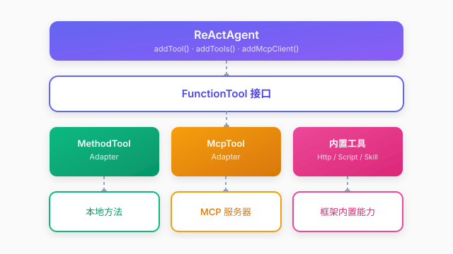

# 工具系统

## 概述

工具系统是 Qualia 框架的核心能力，为智能体提供外部能力扩展。框架采用**适配器模式**，将不同来源的能力统一适配为 `FunctionTool` 接口，实现工具的标准化调用。

### 设计理念

工具系统采用**适配器模式**，无论工具来自本地方法、MCP 服务器还是内置实现，对智能体而言都是统一的 `FunctionTool` 接口。注解方式零侵入，无需修改现有代码即可暴露工具；类型转换、参数解析、Schema 生成均由框架自动完成，开发者只需关注业务逻辑本身。

### 架构分层



## 快速开始

### 方式一：注解方式（推荐）

使用 `@AsFunctionTool` 注解普通 Java 方法，零侵入地暴露工具：

```java
public class WeatherService {

    @AsFunctionTool(name = "get_weather", description = "获取指定城市的天气信息")
    public String getWeather(
            @AsParameter(description = "城市名称") String city,
            @AsParameter(description = "温度单位", required = false) String unit
    ) {
        WeatherInfo weather = fetchWeather(city, unit);
        return JSON.toJSONString(weather);
    }
}
```

注册到智能体：

```java
ReActAgent agent = new ReActAgent(chatModel, memory);
agent.addTools(new WeatherService());  // 扫描并注册所有注解方法
```

### 方式二：继承方式

继承 `FunctionTool` 类，实现完整控制：

```java
public class WeatherTool extends FunctionTool {
    
    public WeatherTool() {
        super("get_weather", "获取指定城市的天气信息", new Parameter[]{
            new Parameter("city", "城市名称", "string", true)
        });
    }

    @Override
    public String execute(Map<String, Object> arguments) {
        String city = (String) arguments.get("city");
        return JSON.toJSONString(fetchWeather(city));
    }
}
```

注册到智能体：

```java
agent.addTool(new WeatherTool());
```

## 工具执行流程

```
用户: "北京今天天气怎么样？"
  ↓
Thought: 用户想查询北京天气，需要调用天气工具
  ↓
Action: get_weather
Arguments: {"city": "北京"}
  ↓
Observation: {"temp": 25, "condition": "晴"}
  ↓
Answer: "北京今天天气晴朗，气温25°C。"
```

## 注册方法对比

| 方法 | 参数类型 | 适用场景 |
|------|----------|----------|
| `addTool(FunctionTool)` | FunctionTool 实例 | 继承方式，需要完整控制 |
| `addTools(Object)` | 包含注解方法的对象 | 注解方式，零侵入 |
| `addMcpClient(params)` | MCP 客户端配置 | 远程 MCP 工具 |

## 注解说明

| 注解 | 目标 | 说明 |
|------|------|------|
| `@AsFunctionTool` | 方法 | 标记方法为工具，指定 name 和 description |
| `@AsParameter` | 参数 | 标记参数为工具参数，指定 description 和 required |

### 类型映射

Java 类型会自动映射为 JSON Schema 类型：

| Java 类型 | JSON Schema 类型 |
|-----------|------------------|
| `String` | string |
| `int`/`Integer`、`long`/`Long`、`double`/`Double`、`float`/`Float` | number |
| `boolean`/`Boolean` | boolean |


