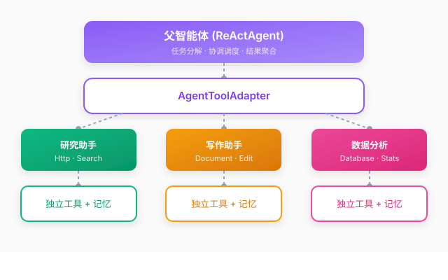

# 多智能体协作

## 概述

多智能体协作允许将多个专业智能体组合为协作系统。通过 `AgentToolAdapter`，子智能体作为工具被父智能体调用，实现任务分解与专业化处理。

### 设计理念

多智能体系统采用**分层协作**架构。父智能体负责理解用户意图、分解任务并协调子智能体的调用；子智能体专注于特定领域，拥有独立的记忆和工具集；每个子智能体调用时会自动生成新的会话ID，确保资源隔离，避免上下文污染。



## 快速开始

### 创建子智能体

```java
// 创建研究专用智能体
ReActAgent researchAgent = new ReActAgent(chatModel);
researchAgent.name("research_agent");
researchAgent.description("专门用于研究和信息收集的智能体");
researchAgent.setSystemPrompt("你是一个专业的研究助手，擅长收集和分析信息。");

// 添加研究相关工具
researchAgent.addTool(new HttpTool());
researchAgent.addTool(new SearchTool());
```

### 注册子智能体

```java
// 创建主智能体
ReActAgent mainAgent = new ReActAgent(chatModel);
mainAgent.setSystemPrompt("你是一个任务协调者，可以调用专业智能体完成任务。");

// 方式一：使用 addSubAgent 方法（推荐）
mainAgent.addSubAgent(researchAgent);

// 方式二：手动创建 AgentToolAdapter
AgentToolAdapter adapter = new AgentToolAdapter(
    researchAgent, 
    "research_agent", 
    "专门用于研究和信息收集的智能体"
);
mainAgent.addTool(adapter);
```

### 执行任务

```java
// 主智能体会自动调用子智能体完成任务
AgentResponse response = mainAgent.call("session-1", "帮我研究人工智能的最新进展");
System.out.println("结果：" + response.getAnswer());
```

## 使用示例

### 示例一：研究助手系统

```java
// 创建研究智能体
ReActAgent researcher = new ReActAgent(chatModel);
researcher.name("researcher");
researcher.description("专业研究助手");
researcher.setSystemPrompt("你是研究专家，擅长收集和分析信息，提供详细的研究报告。");
researcher.addTool(new HttpTool());

// 创建写作智能体
ReActAgent writer = new ReActAgent(chatModel);
writer.name("writer");
writer.description("专业写作助手");
writer.setSystemPrompt("你是写作专家，擅长将复杂信息转化为清晰易懂的文章。");

// 创建主协调智能体
ReActAgent coordinator = new ReActAgent(chatModel);
coordinator.setSystemPrompt("你是任务协调者。对于研究任务，调用 researcher；对于写作任务，调用 writer。");
coordinator.addSubAgent(researcher);
coordinator.addSubAgent(writer);

// 执行任务
AgentResponse response = coordinator.call("session-1", "写一篇关于量子计算的研究报告");
```

### 示例二：数据分析流水线

```java
// 数据收集智能体
ReActAgent dataCollector = new ReActAgent(chatModel);
dataCollector.name("data_collector");
dataCollector.description("数据收集专家");
dataCollector.addTool(new DatabaseQueryTool());

// 数据分析智能体
ReActAgent dataAnalyzer = new ReActAgent(chatModel);
dataAnalyzer.name("data_analyzer");
dataAnalyzer.description("数据分析专家");
dataAnalyzer.addTool(new StatisticalTool());

// 报告生成智能体
ReActAgent reportGenerator = new ReActAgent(chatModel);
reportGenerator.name("report_generator");
reportGenerator.description("报告生成专家");

// 组装流水线
ReActAgent pipeline = new ReActAgent(chatModel);
pipeline.setSystemPrompt("你是数据分析流水线管理者。按顺序调用：1.数据收集 2.数据分析 3.报告生成");
pipeline.addSubAgent(dataCollector);
pipeline.addSubAgent(dataAnalyzer);
pipeline.addSubAgent(reportGenerator);
```
