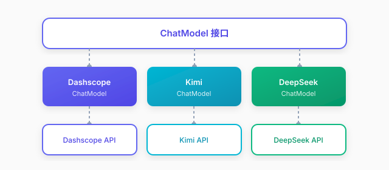

# 模型服务

## 概述

模型服务是 Qualia 框架的模型适配层，提供统一的接口抽象，支持多种大语言模型的无缝接入。框架采用**接口统一、厂商适配**的设计，让业务代码与具体模型解耦。

### 设计理念

模型服务采用**接口统一、厂商适配**的设计，无论底层是 Dashscope、OpenAI 还是其他厂商，对业务代码而言都是统一的 `ChatModel` 接口。框架原生支持流式输出（`Flux<ChatResponse>`），实现打字机效果和实时反馈，同时通过实现接口即可接入新的模型厂商，保持良好的可扩展性。

### 模型类型

| 类型 | 接口 | 包路径 | 用途 |
|------|------|--------|------|
| 对话模型 | `ChatModel` | `core.chat` | 文本生成、对话交互 |
| 嵌入模型 | `EmbeddingModel` | `core.embedding` | 文本向量化，用于语义搜索 |
| 重排模型 | `RerankModel` | `core.rerank` | 检索结果重排序，提升相关性 |

### 架构分层



## 快速开始

### 基础对话

```java
// 创建模型（构造函数只需 apiKey，其余参数通过 setter 设置）
ChatModel model = new DashscopeChatModel("sk-xxx");

// 简单对话
ChatResponse response = model.chat("你好，请介绍一下自己");
String answer = response.getChoices().get(0).getMessage().getContent();

// 带历史的多轮对话
List<ChatMessage> messages = Arrays.asList(
    ChatMessage.system("你是一个专业的翻译助手"),
    ChatMessage.user("将以下英文翻译成中文：Hello, world!"),
    ChatMessage.assistant("你好，世界！"),
    ChatMessage.user("再翻译一句：Good morning!")
);
ChatResponse chatResponse = model.chat(messages);
```

### 流式输出

```java
Flux<ChatResponse> responseFlux = model.chatStream("写一篇关于AI的短文");

responseFlux.subscribe(
    chunk -> {
        // 逐步获取内容
        String content = chunk.getChoices().get(0).getMessage().getContent();
        System.out.print(content);
    },
    error -> System.err.println("错误：" + error.getMessage()),
    () -> System.out.println("\n生成完成")
);
```

## Dashscope 实现

### 支持的模型

| 模型 | 特点 | 适用场景 |
|------|------|----------|
| `qwen3.7-plus` | 默认模型，平衡性能和成本 | 生产环境（默认值） |
| `qwq-plus` | 推理模型，支持 `reasoning_content` | 深度思考、思维链 |

### 嵌入与重排序

```java
// 文本嵌入（默认模型 text-embedding-v4，维度 1024）
EmbeddingModel embeddingModel = new DashscopeEmbeddingModel("sk-xxx");
List<Float> vector = embeddingModel.embed("这是一段测试文本");

// 文档重排序（默认模型 qwen3-rerank）
RerankModel rerankModel = new DashscopeRerankModel("sk-xxx");
List<RerankResult> results = rerankModel.rerank("如何学习编程？", documents, 3);
```

## 高级配置

### 响应格式

Qualia 支持通过 `ResponseFormatType` 枚举控制模型输出格式：

| 格式 | 说明 | 适用场景 |
|------|------|----------|
| `TEXT` | 默认，输出纯文本 | 常规对话、文本生成 |
| `JSON_OBJECT` | 输出标准 JSON 字符串 | 结构化数据提取、工具调用 |

```java
import conf.chat.model.cn.lunarlanding.qualia.core.ResponseFormatType;

// 方式1：在 chat() 方法中指定格式
List<ChatMessage> messages = List.of(ChatMessage.user("请按照 JSON 格式输出用户信息"));
ChatResponse response = model.chat(messages, ResponseFormatType.JSON_OBJECT);

// 方式2：流式调用时指定格式
Flux<ChatResponse> stream = model.chatStream(messages, ResponseFormatType.JSON_OBJECT);
```

> **注意**：使用 `JSON_OBJECT` 时，需在提示词中明确指示模型输出 JSON，否则可能报错。

### 自定义参数

```java
DashscopeChatModel model = new DashscopeChatModel("sk-xxx");
model.modelName("qwen3.7-plus");
model.temperature(0.7);   // 温度：控制随机性
model.maxTokens(2000);    // 最大输出长度
model.topP(0.9);          // 核采样
```

### 动态配置

```java
// 运行时修改配置
model.apiKey("new-api-key");
model.baseUrl("https://custom-endpoint.example.com");
```

## Token 监控

所有响应都包含 Token 用量统计（`ChatUsage` 为独立类）：

```java
ChatResponse response = model.chat("你好");
ChatUsage usage = response.getUsage();

System.out.println("输入 Token：" + usage.getPromptTokens());
System.out.println("输出 Token：" + usage.getCompletionTokens());
System.out.println("总 Token：" + usage.getTotalTokens());
```

