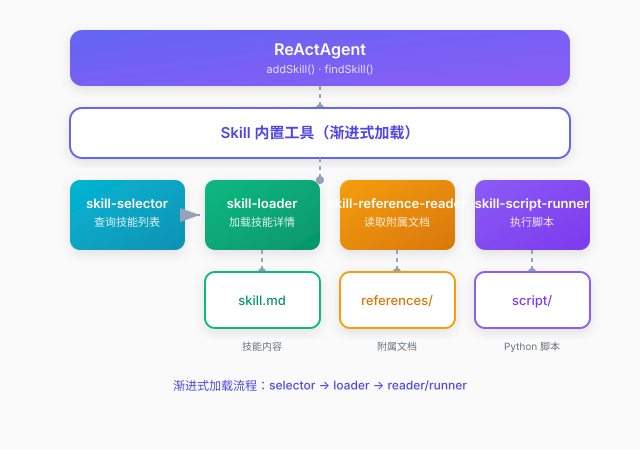

# 技能管理

## 概述

技能（Skill）是 Qualia 框架中的高层抽象，用于将复杂任务封装为可复用的执行单元。每个技能将一组 Python 脚本和标准操作流程（SOP）打包在一起，让智能体能够执行专业化的领域任务。

### 设计理念

技能系统采用**渐进式披露**设计：

**列表查询**：智能体通过 `skill-selector` 工具查询可用技能列表，**加载详情**：通过 `skill-loader` 加载匹配技能的 skill.md 内容、脚本列表、附属文档列表，**按需获取**：附属文档通过 `skill-reference-reader` 工具查询，脚本通过 `skill-script-runner` 工具执行

这种设计避免信息过载，技能列表不会占用系统提示词空间，智能体按需获取所需信息。

### 架构分层



## 快速开始

### 方式一：从目录加载（推荐）

准备技能目录结构，然后使用 `DirectorySkillLoader` 加载：

```
skills/
└── data_analysis/
    ├── skill.md              # 技能内容
    ├── references/           # 附属文档
    └── script/               # Python 脚本
        ├── query.py
        └── chart.py
```

加载代码：

```java
// 1. 创建目录加载器
DirectorySkillLoader loader = new DirectorySkillLoader(Paths.get("skills"));

// 2. 加载所有技能
List<Skill> skills = loader.loadAll();

// 3. 注册到智能体
ReActAgent agent = new ReActAgent(chatModel, memory);
for (Skill skill : skills) {
    agent.addSkill(skill);
}
```

### 方式二：编程方式创建

```java

Skill skill = new Skill("data_analysis", "分析数据并生成统计报告")
    .withContent("""
        # 数据分析技能
        
        ## 使用说明
        本技能用于分析数据并生成统计报告。
        
        ## 执行步骤
        1. 加载系统数据
        2. 执行统计分析
        3. 生成数据图表
        4. 输出分析报告
    """)
    .addScript(new SkillScript("query", "数据查询", Paths.get("scripts/query.py")))
    .addScript(new SkillScript("chart", "生成图表", Paths.get("scripts/chart.py")));

// 注册到智能体
agent.addSkill(skill);
```

## 内置工具

智能体自动注册以下 Skill 相关工具：

### skill-selector

查询可用技能列表，返回技能名称和简要描述。智能体在处理用户问题时，会先调用此工具判断是否有匹配的技能。

| 参数 | 类型 | 必填 | 说明 |
|------|------|------|------|
| 无 | - | - | 返回所有可用技能列表 |

### skill-loader

加载指定技能，暴露 skill.md 内容、脚本列表和附属文档列表。

| 参数 | 类型 | 必填 | 说明 |
|------|------|------|------|
| `skill_name` | string | 是 | 要加载的技能名称 |

### skill-reference-reader

按需获取技能的附属文档。

| 参数 | 类型 | 必填 | 说明 |
|------|------|------|------|
| `skill_name` | string | 是 | 技能名称 |
| `file_name` | string | 是 | 文档文件名 (如 api.md) |

### skill-script-runner

执行技能中的 Python 脚本。

| 参数 | 类型 | 必填 | 说明 |
|------|------|------|------|
| `skill_name` | string | 是 | 技能名称 |
| `script_name` | string | 是 | 脚本名称 (如 script_data_analysis_query) |
| `arguments` | string | 否 | 脚本参数，JSON 格式 |

## 脚本命名规则

脚本工具命名规则：`script_{skill_name}_{script_name}`

| 技能名称 | 脚本文件 | 脚本工具名 |
|----------|----------|------------|
| `data_analysis` | `query.py` | `script_data_analysis_query` |
| `data_analysis` | `chart.py` | `script_data_analysis_chart` |

## 工具系统关系

技能系统在工具系统之上提供了任务编排能力：

| 层级 | 职责 | 示例 |
|------|------|------|
| 工具层 | 提供单个函数声明和执行机制 | HTTP 请求、数据库查询 |
| 技能层 | 提供任务编排、SOP 管理和脚本执行 | 数据分析流程、报告生成流程 |
